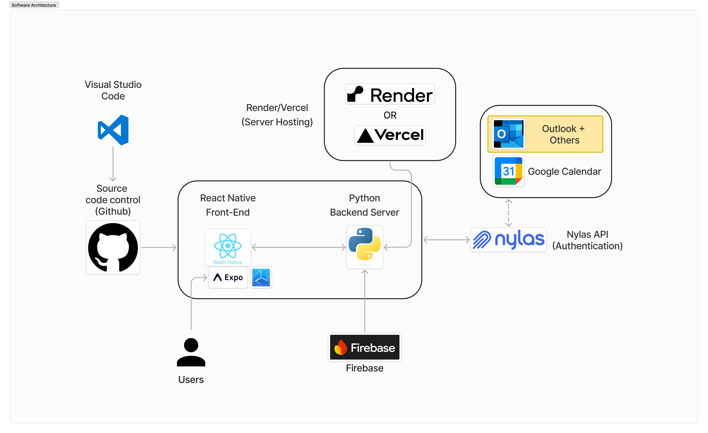

# Juncture - React Native Expo Project

A mobile application built with React Native and Expo.

## Prerequisites

Before you begin, ensure you have the following installed:
- Node.js
- npm
- Expo CLI
- iOS Simulator (Mac only)

## Tech Stack

Frontend:
- **Framework:** React Native
- **Testing Platform:** Expo
- **App Testing:** Expo Go
- **IDE:** Visual Studio Code

Backend:
- **Server:** Python Backend Server
- **Hosting:** Render/Vercel (Server Hosting)
- **Database:** Firebase
- **Authentication:** Nylas API

Integration:
- **Calendars:**
  - Google Calendar Integration using Nylas API
  - And Potentially Outlook integration

## Installation

1. Download the repository:

2. Install dependencies:
```bash
npm install
```

3. Start the development server:
```bash
npx expo start --clear
```

Architecture Outline
<div style="display: flex; flex-wrap: wrap; gap: 20px;">
  
</div>